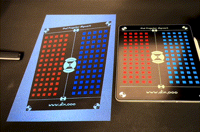

# Projector Assist

A small Keystone tool to project images onto a surface via a video projector. Useful for tracing images. In this case,
an ipad to achieve cleaner live or recorded white boarding in the iPads notes app.



## Running

To run the project in one go, run the following command:

```bash
deno run -A npm:concurrently "cd server && deno task dev" "cd browser && deno task dev"
```

 - Edit `config.example.ts` and rename to `config.ts`. Otherwise default localhost.
 - Persists state changes to `server/db.json` (every 3 seconds if changes exist).
 - `util_apply_ipad_portrait_rotation.sh` will rotate images in `assets/slides/*` if they contain the string `portrait` in their filename and are not already rotated to landscape aspect ratio.
    > This is to be able to author slides in portrait mode for an iPad screen and project them correctly in the viewport.

## Using

1. Open the browser at `http://localhost:3000` for the projector view.
2. Open the browser at `http://localhost:3000/controller` for the controller to keystone the projection.

## Dependencies

- Requires ImageMagick (brew install imagemagick) to rotate images
- You need to have Deno v2.0.0 or later installed to run this repo.